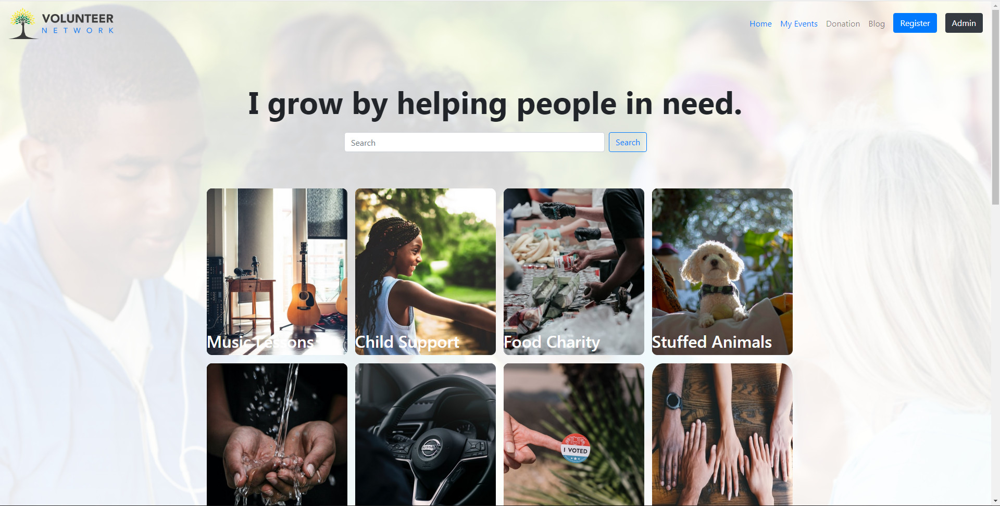
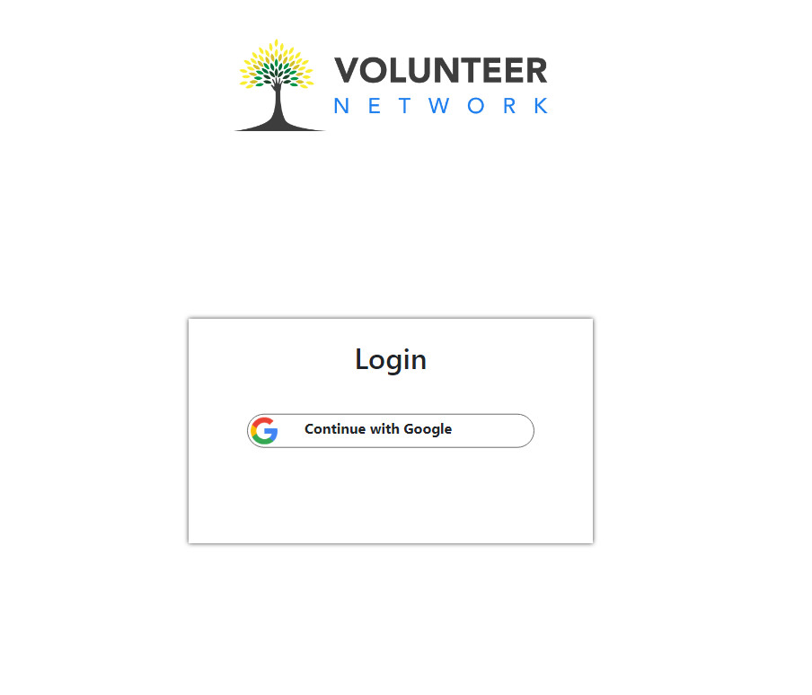

# Resume Drive Link : https://drive.google.com/file/d/1tTgnJOqapxgjETIjJMTAT3s0RixQS0tl/view?usp=sharing
# Live Website Link : https://volunteer-network-ab1a5.web.app/

# Home Page

# Login Page

# Project Details
<ul>
  <li>Project name was volunteer network . I implement my node.js , mongoDb knowledge in this project and also focus on my design.</li>
  <li>People can choose volunteer work for a specific date and delete and an admin can add new volunteer work visible in events section</li>
  <li>Customer also feel dynamic experience with fully satisfaction</li>
  <li>Without wasted valuable time of customer , he/she can go one page to another page without page loading</li>
  <li>Also it is a mid level project for junior web developer . I also using react , react router , firebase for deploy and heroku for data load</li>
</uL>
